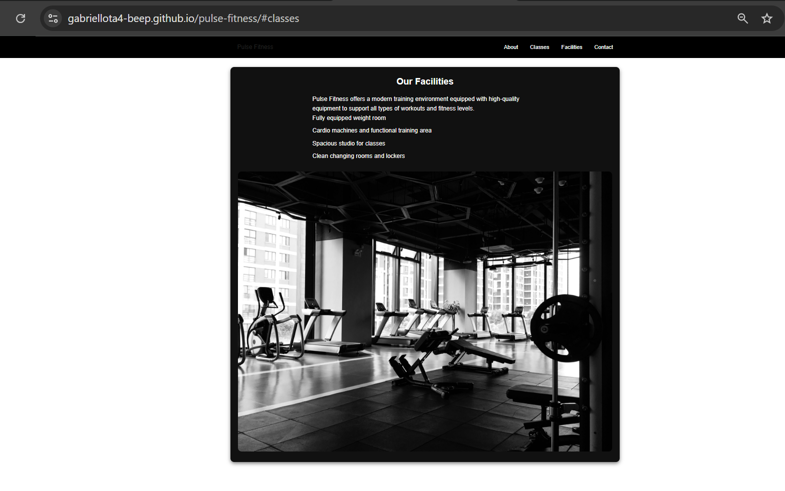
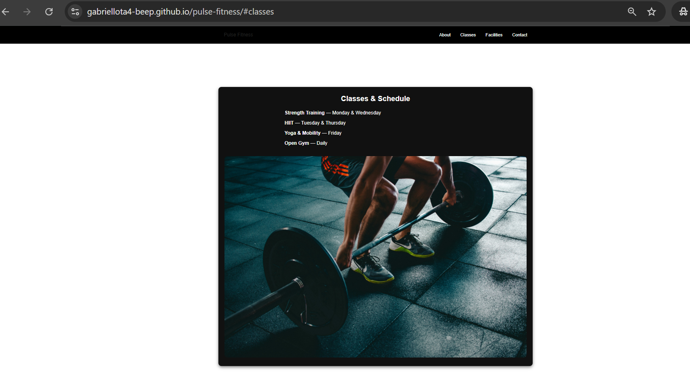
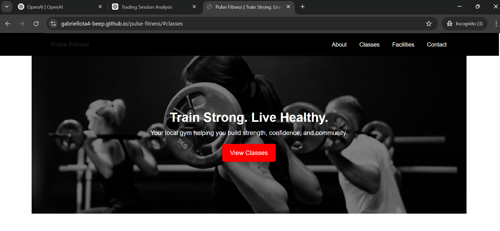

# Pulse Fitness

A responsive, user-centric website for a modern gym. The site provides information about classes, facilities, and contact details for potential members.

---

## UX (User Experience)

### Project Goals
The goal of this project is to create a simple, visually appealing gym website that provides clear information about services and encourages users to engage with the gym.

### User Goals
- Find information about gym classes and schedules
- Learn about available facilities
- Contact the gym easily
- Navigate the site smoothly on all devices

### User Stories
- As a new user, I want to quickly understand what the gym offers
- As a user, I want to view class schedules easily
- As a user, I want a clean and simple layout that is easy to navigate

---

## Design

### Colour Scheme
- Black and white theme for a modern fitness aesthetic
- Red used for call-to-action elements (buttons)

### Typography
- Arial, Helvetica, sans-serif for readability

### Layout
- Single-page layout with smooth navigation
- Sticky navigation bar for easy access
- Hero section with strong visual impact
- Card-style sections for better structure

---

## Features

- Responsive navigation bar
- Hero section with call-to-action
- Classes section with schedule
- Facilities section with details
- Contact section with key information
- Footer with social links

---

## Future Improvements

- Add membership signup form
- Add interactive booking system
- Include trainer profiles
- Add testimonials section

---

## Testing

### Manual Testing
- Navigation links tested and working correctly
- Website responsive across mobile, tablet, and desktop
- Images display correctly
- All sections render properly

### Validator Testing
- HTML validated using W3C Validator
- CSS validated using W3C CSS Validator

### Bugs Fixed
- Fixed hero image layout issues
- Fixed CSS not loading due to incorrect deployment
- Improved layout spacing and alignment

---

## Deployment

This project is deployed using GitHub Pages:

👉 https://gabriellota4-beep.github.io/pulse-fitness/

---

## GitHub Repository

👉 https://github.com/gabriellota4-beep/pulse-fitness

---

## Screenshots

### Hero Section

### Classes Section

### Facilities Section

---

## Credits

- Images from Unsplash
- Development guidance from Code Institute course material

---

## Author

Gabriel Dada Lota